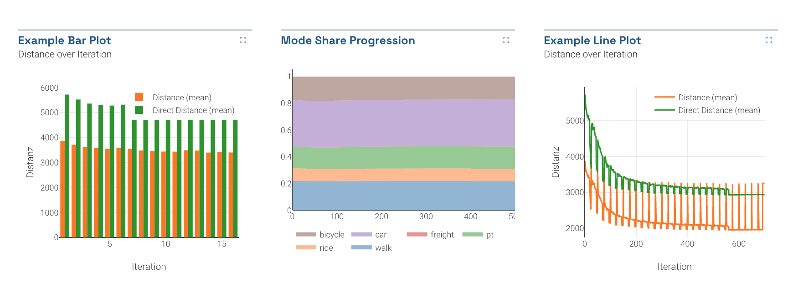

_Some typical bar, area, and line charts_

These simple charts are the core of many dashboards.

## Usage

Bar, area, and line charts can only be included as panels in **Dashboards**. See Dashboard documentation for general tips on creating dashboard configurations.

- Each chart panel is defined inside a **row** in a `dashboard-*.yaml` file.
- Choose from panel types `bar` `line` and `area` in the dashboard configuration.
- Standard title, description, and width fields define the frame.

---

### Sample dashboard.yaml config snippet

```yaml
layout:
  row1:
    - type: 'bar'
      title: 'Bar Plot'
      description: 'By iteration'
      width: 2
      props:
        dataset: '*drt_customer_stats.csv'
        x: 'iteration'
        xAxisName: 'Iteration'
        yAxisName: 'Distance'

    - type: 'area'
      title: 'Mode Share Progression'
      description: 'By iteration'
      width: 1
      props:
        dataset: '*modestats.txt'
        x: 'Iteration'

    - type: 'line'
      title: 'Mean Distances by Mode'
      description: 'per Iteration'
      width: 1
      props:
        dataset: '*drt_customer_stats.csv'
        x: 'iteration'
        xAxisName: 'Iteration'
        yAxisName: 'Distance'
        columns: [distance_m_mean, directDistance_m_mean]
        legendName: ['Distance (mean)', 'Direct Distance (mean)']
```

---

### Bar, area, line chart properties

Each chart can have the following properties in the `props` section:

_THIS API IS CHANGING RAPIDLY, SORRY._

**dataset:** (Required) String. The filepath containing the data. May include wildcards \* and ?.

**x:** (Required) String. The column containing x-values.

**columns:** (Required) Array of strings. List the column names of the columns which have the values to be graphed. Each element will be its own line/color. Example: `['distance', 'duration']`

**usedCol:** Same as _columns_ above, but for area and line charts (API will be merged & aligned soon)

**useLastRow:** true/false. If set to true, only the last row of the datafile will be used to build the pie chart. For example, this is useful for MATSim outputs which list every iteration's output, if you are only in the final iteration.

**stacked:** true/false for bar charts, whether to stack multiple bars

**legendName:** Array of strings. Legend titles for each line. The column names will be used if this is omitted.

**xAxisName/yAxisName:** Labels for the axes.
