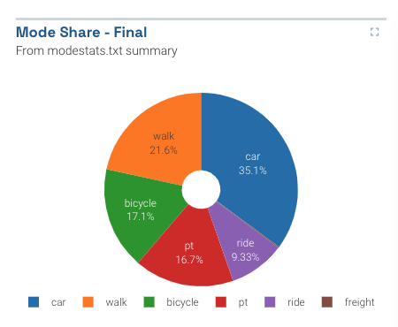

_It's a pie chart_

Sometimes a pie chart is all you need. Please remember to use them sparingly; there are often better ways to depict aggregate data.

## Usage

Pie charts can only be included as panels in **Dashboards**. See Dashboard documentation for general tips on creating dashboard configurations.

- Each pie chart panel is defined inside a **row** in a `dashboard-*.yaml` file.
- Use panel `type: pie` in the dashboard configuration.
- Standard title, description, and width fields define the frame.

---

### Sample dashboard.yaml config snippet

```yaml
layout:
  row1:
    - type: 'pie'
      title: 'Mode Share'
      description: 'From modestats.txt'
      width: 1
      dataset: '*modestats.txt'
      useLastRow: true
      ignoreColumns: ['Iteration']
```

---

### Pie chart properties

Pie chart properties:

**dataset:** String. The filepath containing the data. May include wildcards \* and ?.

**useLastRow:** true/false. If set to true, only the last row of the datafile will be used to build the pie chart. For example, this is useful for MATSim outputs which list every iteration's output, if you are only in the final iteration.

**ignoreColumns:** Array of strings. List the column names of any columns that should be left out of the pie chart (e.g. Iteration). Example: `['Iteration']`
