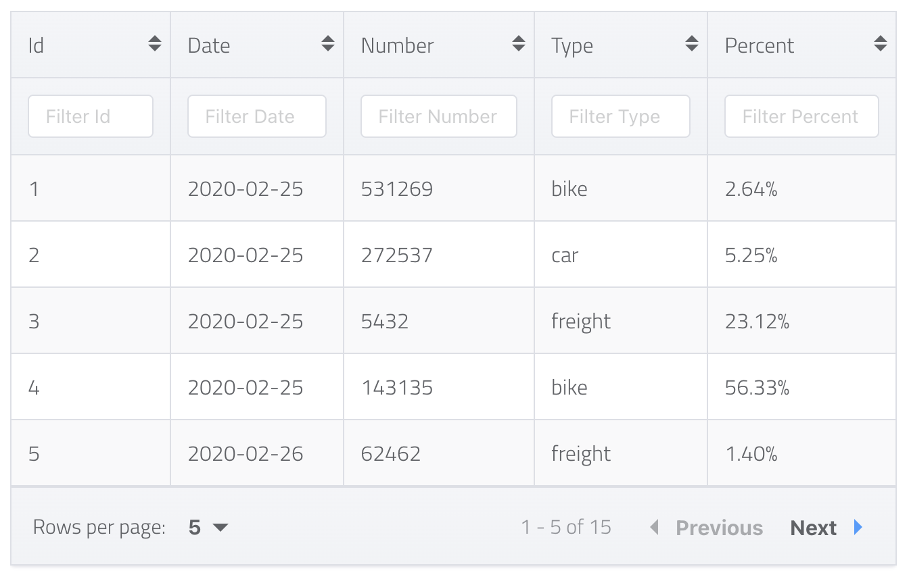

_Table Viewer_

The Table viewer is able to display csv files clearly.

## Usage

The table viewer can only be included as panels in **Dashboards**. See Dashboard documentation for general tips on creating dashboard configurations.

- Each table viewer panel is defined inside a **row** in a `dashboard-*.yaml` file.
- Use panel `type: csv` in the dashboard configuration.
- Standard title, description, and width fields define the frame.

---

### Sample dashboard.yaml config snippet

```yaml
layout:
  row1:
    - type: 'csv'
      title: Example Title
      dataset: 'data.csv'
      enableFilter: true
      hide: [bike, car]
      show: [bus]
      showAllrows: false
```

---

### Table viewer properties

Table viewer properties:

**dataset:** String. The filepath containing the csv-file.

**enableFilter:** true/false. This option could be used to filter columns. This option adds a filter mask to each column. The default setting is false.

**hide:** Array of strings. List of column names that should be ignored.

**show:** Array of strings. List of column names that should be displayed. If the hide and show option are in the .yaml file the hide option will be ignored.

**showAllRows:** true/false. This option defines whether the whole table should be displayed or if there are several pages. The default setting is false.
